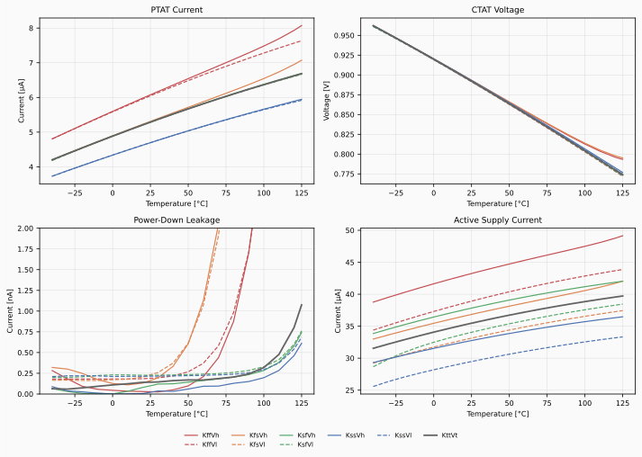
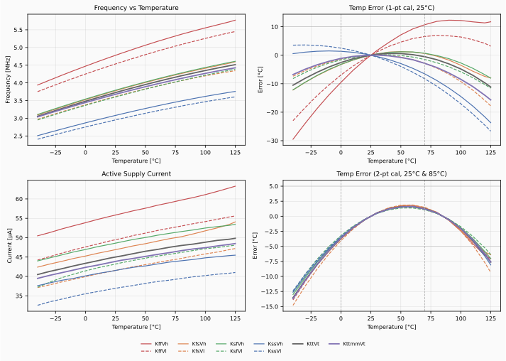
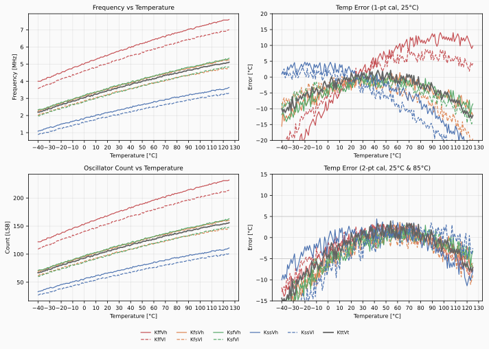
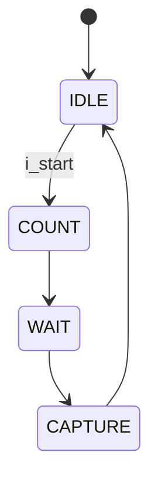

- **Repository:** [https://github.com/analogicus/lelo_gr03_sky130a](https://github.com/analogicus/lelo_gr03_sky130a)
- **Documentation:** [https://analogicus.github.io/lelo_gr03_sky130a](https://analogicus.github.io/lelo_gr03_sky130a)

# Who

We are group 3 in the 2026 Advanced Integrated Circuits course.

# Why

To get an understanding of the design of advanced integrated circuits in CMOS
technology, and to get an overview of the circuits needed to make a
System-On-Chip.

# How

The course consists, among other things, of a project divided into 5 (6 if
tapeout) milestones. The idea is to design a temperature sensor. In the README
below, each milestone will have a short description.

# Key parameters

<!-- AUTO:KEY_PARAMS -->
| Parameter          | Min | Typ             | Max | Unit |
|:-------------------|:---:|:---------------:|:---:|:----:|
| Technology         |     | Skywater 130 nm |     |      |
| AVDD               | 1.7 | 1.8             | 1.9 | V    |
| Temperature        | -40 | 27              | 125 | C    |
| Tc (conversion)    |     | ~30.5           |     | µs   |
| Ts (sample rate)   |     | 100             |     | ms   |
| Ileak (power-down) |     | ~0.2            | 1   | nA   |
| Iact (active)      |     | ~51             | 100 | µA   |
| Iavg (average)     |     | ~15.8           | 50  | nA   |
| Kerr (1-pt cal)    |     | ±8.9            | ±10 | C    |
| Kerr (2-pt cal)    |     | ±8.9            | ±5  | C    |
<!-- /AUTO:KEY_PARAMS -->

# Milestone 1: The Bandgap

The bandgap OTA is a two-stage Miller OTA (see [BANDGAP_OTA](#bandgap_ota)). The
input NMOS transistors are low-threshold-voltage transistors, since they operate
with the diode drop in the input common-mode voltage, reducing it from ~0.8V to
~0.5V over the temperature range of -40° to 125°.

The bandgap circuit (see [BANDGAP_CIRCUIT](#bandgap_circuit)) uses a 1:8 BJT
ratio (Q1 = 1×, Q2 = 8×). If we compare the voltages across the lower
diode-connected BJTs, Q1 and Q2, the voltage difference will be proportional to
the size difference and temperature:

$$V_{D1} - V_{D2} = \Delta V_{BE} = V_T \text{ln}\left (\frac{I_D}{I_{S1}}\right
) - V_T \text{ln}\left (\frac{I_D}{I_{S2}}\right ) = V_T \text{ln}(N)$$

Here $V_T = \frac{kT}{q}$. The V_CTAT voltage across Q1 will have a negative
temperature coefficient and will be approximately linear over the temperature
range of interest (-40° to 125°). I_PTAT will be the current set by the voltage
difference $\Delta V_{BE}$ over the resistor, which we denote as R1. The
operational amplifier forces its inputs to be equal, resulting in a voltage drop
$V_{D1} - V_{D2} = \Delta V_{BE}$ across R1. I_PTAT will thus be $\Delta V_{BE}
/ R1$.

The plots below show the corner simulations over temperature for PTAT current,
CTAT voltage, power-down leakage current, and active supply current. The PTAT
current varies significantly across process corners, as verified by the
resistance variation of resistor R1 across the different corners. We tested this
by replacing R1 with a generic resistor with no process variations and observed
much less variation, with a worst-case error of less than 10% compared to 30%.
The power-down leakage stays well below 1 nA across all corners.

# Milestone 2: The Oscillator

The PTAT current from the bandgap charges a timing capacitor (12 MIM caps, see
OSCILLATOR, and the voltage across the capacitors feeds into the
COMPARATOR alongside the reference voltage V_CTAT. Then, if the
capacitor voltage exceeds V_CTAT, the comparator fires, and a reset pulse
discharges the capacitor through an NMOS switch, restarting the cycle. The
comparator output feeds into a D flip-flop, which divides the frequency by 2 to
produce a clean square wave. Since both the charging current (PTAT) and the
threshold voltage (CTAT) are proportional to temperature, the resulting output
frequency is approximately linear in temperature. Using the equation for current
through a capacitor:

$$i = C \frac{dV}{dt} \Rightarrow dt = C \frac{dV}{i} \Rightarrow f(T) = \frac{1}{dt} = \frac{I_{PTAT}(T)}{C \cdot V_{CTAT}(T)} $$

## Temperature error estimation

Since there is no FSM and counter yet, we estimate the temperature measurement error directly from the simulated frequency. The idea is to invert the frequency-to-temperature relationship: given a measured frequency, we compute what temperature a calibrated system would report, and compare that to the actual simulation temperature.

**1-point calibration** uses a single calibration point at 25°C. We take the nominal frequency-vs-temperature slope from the typical corner (KttVt) and apply it to all corners. For each corner, we compute the offset at 25°C and convert frequency back to temperature using:

$$T_{meas} = \text{slope}_{nom} \cdot f + \text{offset}_{25}$$

The calibration assumes all chips share the same slope, which breaks down at extreme PVT corners.

**2-point calibration** fits a line through two calibration points at 25°C and 85°C for each individual corner. This per-chip calibration removes slope variation and only leaves residual non-linearity as error:

$$T_{meas} = \frac{85 - 25}{f_{85} - f_{25}} \cdot (f - f_{25}) + 25$$

The plots below show the oscillator performance across PVT corners. All corners pass the 2-point calibration spec of ±5°C with margin (max 2.1°C error). The 1-point calibration meets ±10°C for most corners, with the extreme corners KffVh and KssVl slightly exceeding the limit.

# Milestone 3: Counter

The goal is to measure the frequency of the oscillator. We assume access to an accurate 32768 Hz clock source. The approach is to power up the oscillator for a fixed number of reference clock cycles and count the output pulses. For example, counting 128 pulses over 2 periods of the 32768 Hz clock gives a frequency of approximately 2.09 MHz. Once we have the frequency, we can calculate the temperature.

The digital block temp_sens.sv implements a 4-state FSM with a dual-edge counter
that captures both rising and falling edges of the oscillator output for 2×
resolution. The FSM powers up the oscillator for one reference clock period (~30
µs), lets the counter settle (CDC safety), then latches the count. See the [FSM
state diagram](#tempsens-fsm) below.

The behavioral simulation fits a 2nd-order polynomial to the SPICE-characterized
oscillator frequency, then sweeps temperature from -40°C to 125°C. The plots
below show the measured count and calibration error across all PVT corners:

# Milestone 4: The physical design
In milestone 4 we implemented the physical design of our oscillator. The layout
of the oscillator, LELO_GR03.mag passes the drc check, but there is some port
trouble in the LVS check. It can't seem to separate VDD_1V8 and VSS causing an
issue. The submodules, BANDGAP_CIRCUIT.mag, BIAS_CIRCUIT.mag and COMPARATOR.mag
passes both drc and lvs check. The issue arises when we connect everything
together in LELO_GR03. The layout can be seen in the figure below. The Left part
of the image comprises the bandgap circuit, the lower right part is the
comparator and D-flip-flop for the relaxation oscillator and the middle area is
the bias circuit generating bias voltages for the OTA (in the bandgap circuit)
and the comparator (lower rigth side). The layout is made to fit in a Tiny
Tapeout template with the digital circuitry being supposed to fit in the upper
right corner. 

## TempSens FSM

<!-- AUTO:FSM -->

| State | `o_pwrup_osc` | Description |
| :--- | :---: | :--- |
| IDLE | 0 | Waiting for trigger. Counter held in reset. |
| COUNT | 1 | Oscillator on. Dual-edge counter runs for one 32768 Hz period. |
| WAIT | 0 | Oscillator off. Counter values settle (CDC safety). |
| CAPTURE | 0 | Count latched into output register. |
<!-- /AUTO:FSM -->
